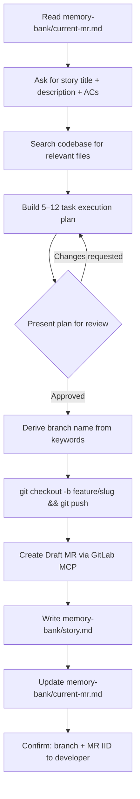
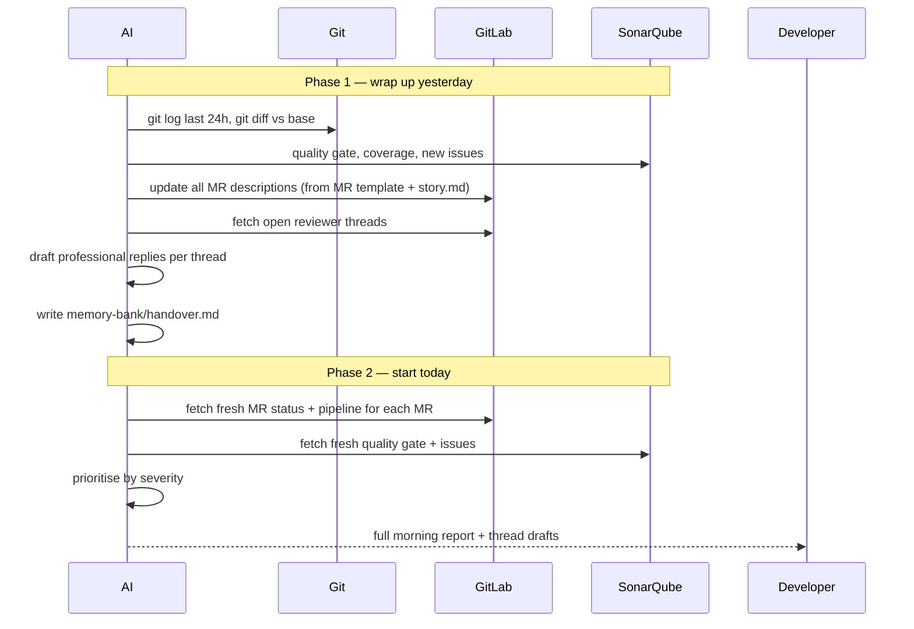
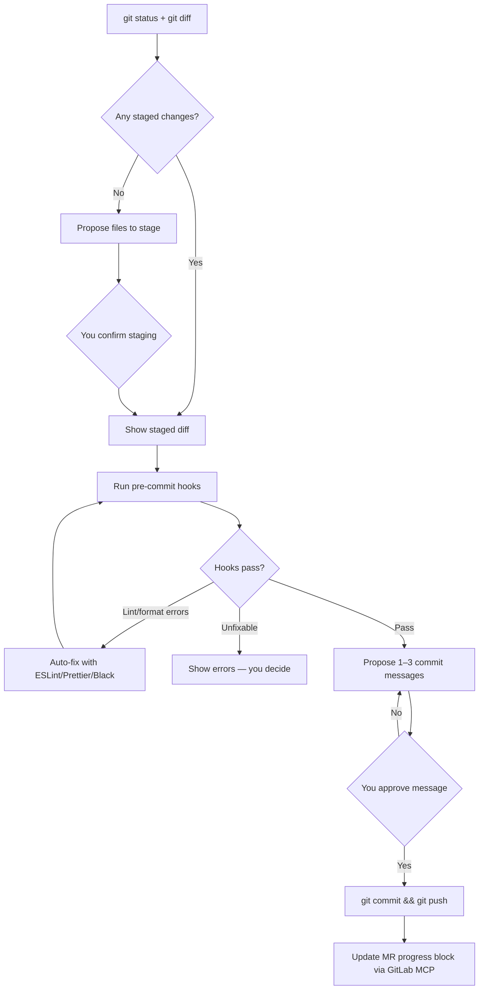
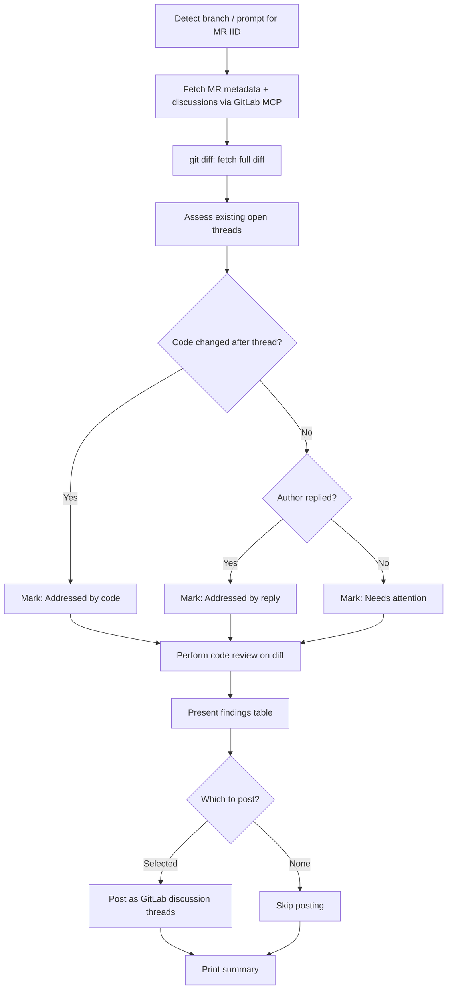
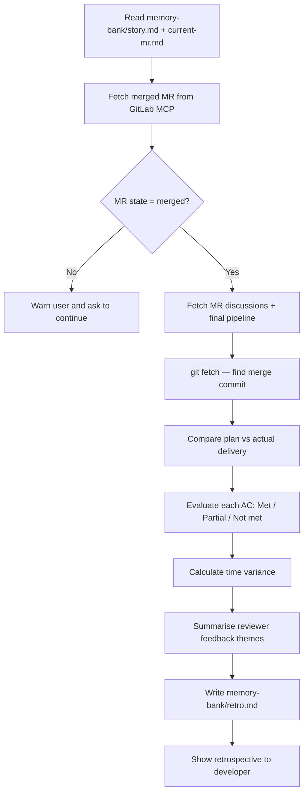

# Workflow Reference

Five workflows cover the entire feature lifecycle. Run them by telling your AI assistant:
> _"Run the [name].md workflow"_

---

## Overview

| Workflow | When | Touches GitLab? | Touches code? |
|---|---|---|---|
| **start.md** | Once, before development begins | Yes — creates MR | No |
| **morning.md** | Every morning | Yes — updates MR descriptions | No |
| **commit.md** | After each set of code changes | Yes — updates MR progress | No (only commits) |
| **review.md** | When asked to review an MR | Yes — posts discussion threads | No |
| **close.md** | Once, after MR is merged | Read-only | No |

---

## start.md — Feature Planning

**Trigger:** You have a new story ready to work on.

```
You → AI: story title + description + acceptance criteria
AI  → You: execution plan (5–12 tasks)
You → AI: approve or request changes
AI  → Git + GitLab: branch created, MR opened
```

### What the AI does, step by step



### Branch naming (enforced by rules.md)

Format: `feature/<keyword>_<keyword>_<keyword>`
Keywords come from the story title — meaningful nouns/verbs only, no generics.

| Story | Branch |
|---|---|
| "Reset password via email" | `feature/password_reset_email` |
| "Paginate product listing" | `feature/product_listing_pagination` |
| "Stripe subscription billing" | `feature/stripe_subscription_billing` |

### Plan format

Each task in the plan has:
- Files to create or modify
- Tests to write
- Acceptance criteria it covers
- SonarQube risks to watch
- Definition of done

### Key rule: nothing is created until you approve the plan.

---

## morning.md — Daily Ritual

**Trigger:** Start of your workday — run this before anything else.

This workflow does **two things in sequence**: closes out yesterday, then sets up today.



### Morning report includes

- SonarQube quality gate (pass/fail, coverage %)
- Per-MR: pipeline status, unresolved thread count, priority rating
- Today's task list (ordered by priority)
- Thread reply drafts ready to copy/paste into GitLab

### What it does NOT do

- Does not post replies to GitLab (you copy/paste the drafts)
- Does not resolve threads
- Does not commit anything

---

## commit.md — Commit Helper

**Trigger:** You have code changes ready to commit.



### Hook support

Configured in `memory-bank/current-mr.md` → `precommit_runner`:

| Value | What runs |
|---|---|
| `lint-staged` | `npx lint-staged` |
| `pre-commit` | `pre-commit run --files ...` |
| `both` | Both in sequence |
| `null` | Auto-detect from project config |

### Commit message format (Angular Conventional Commits)

```
<type>(<scope>): <subject>

<body — what and why, not how>

<footer — BREAKING CHANGE: ... if applicable>
```

Types: `feat` `fix` `docs` `style` `refactor` `perf` `test` `build` `ci` `chore` `revert`

### MR progress block

After every push, the AI injects a `<!-- PROGRESS:START -->` block into the MR description with:
- Last commit message + SHA
- Recent commit list (newest first, max 10)
- Task progress from `story.md` (N / M tasks done)

If GitLab MCP is unavailable, the commit still goes through — the MR update is best-effort.

---

## review.md — MR Code Review

**Trigger:** You're asked to review someone else's MR (or your own before asking for approval).



### Review categories

| Category | Examples |
|---|---|
| 🔴 Bug | Null dereference, off-by-one, swallowed exception |
| 🔴 Security | SQL injection, hardcoded secret, missing auth check |
| 🟠 Performance | N+1 query, unbounded loop, missing index |
| 🟡 Style | Generic name, duplicated logic, dead code |
| 🔵 Tests | Missing coverage for new path, implementation-coupled assertions |
| 🔵 Docs | Undocumented public API change |

### Thread assessment

For each existing open thread, classifies as:
- `✅ Addressed by code` — the relevant file/area was changed after the thread was opened
- `💬 Addressed by reply` — the MR author replied to the reviewer
- `⚠️ Needs attention` — no code change or reply since the thread was opened

### Single approval gate

After showing all findings, asks once which to post. Everything else runs automatically.

### What it does NOT do

- Does not approve or merge the MR
- Does not resolve threads
- Does not write or fix code
- Does not post anything without your selection

---

## close.md — Post-Merge Retrospective

**Trigger:** Your MR has been merged in GitLab. Run this to capture learnings.



### Retrospective covers

| Section | What's in it |
|---|---|
| AC compliance | Each criterion: met/partial/not met + evidence |
| Plan vs reality | Tasks completed as planned vs skipped vs unplanned |
| Time variance | Estimated days vs actual calendar days + reasons |
| Quality | Final coverage %, SonarQube status, reviewer themes |
| Lessons learned | What went well, what to improve, root causes |
| Recommendations | Actionable items for the next feature |

### What it does NOT do

- Does not merge the MR — you do that in GitLab UI
- Does not modify any source code
- Does not update GitLab (read-only)

---

## Shared Rules

These apply across all workflows. Full details in `rules.md`.

- **MCP errors**: always handled gracefully — workflow continues, user is informed
- **Approval gates**: commits and MR creation require explicit user confirmation
- **memory-bank files**: `handover.md`, `story.md`, `retro.md` are gitignored — local AI state only, never committed to the project repo
- **MR template**: `eod` and `morning` updates follow `.gitlab/merge_request_templates/default.md`
- **SonarQube**: always fetch quality gate, coverage, bugs, vulnerabilities, code smells — results drive priorities
