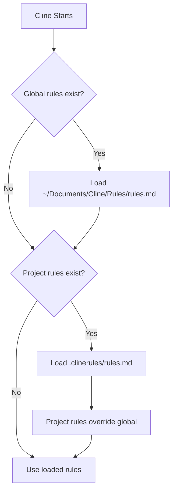

# Cline GitLab Workflow Kit

**AI-assisted GitLab MR workflows** with automatic status checks, MR updates, and code quality tracking.

Works with: GitLab + SonarQube + Cline (VS Code extension)

---

## ⚡ Quick Start (10 minutes)

### 1) Install MCP Servers

```bash
pip install uv

# Option A: From requirements.txt (recommended)
uv pip install -r requirements.txt

# Option B: Direct install
uv pip install python-gitlab-mcp sonar-mcp
```

### 2) Install Workflows Globally (Recommended)

```bash
# Clone the repo
git clone https://github.com/siwardean/cline-workflow.git
cd cline-workflow

# Install MCP servers
uv pip install -r requirements.txt

# Copy workflows globally (works for ALL projects)
mkdir -p ~/Documents/Cline/Rules
mkdir -p ~/Documents/Cline/Workflows
cp .clinerules/rules.md ~/Documents/Cline/Rules/
cp .clinerules/workflows/* ~/Documents/Cline/Workflows/

# Done! Can delete the repo now
cd ..
rm -rf cline-workflow
```

### 3) Configure MCP Servers in VS Code

**Option A: Using Cline UI (Recommended)**
1. Open VS Code → Cline extension
2. Click **Settings** (gear icon) → **MCP Servers**
3. Add servers using the UI

**Option B: Edit JSON Directly**

Open Cline settings and add to `cline_mcp_settings.json`:

```json
{
  "mcpServers": {
    "gitlab": {
      "command": "python-gitlab-mcp",
      "args": [],
      "env": {
        "GITLAB_URL": "https://gitlab.company.tld",
        "GITLAB_TOKEN": "your-personal-access-token-here",
        "GITLAB_ALLOWED_PROJECT_IDS": "12345,67890"
      }
    },
    "sonarqube": {
      "command": "sonar-mcp",
      "args": [],
      "env": {
        "SONAR_URL": "https://sonar.company.tld",
        "SONAR_TOKEN": "your-sonar-token-here"
      }
    }
  }
}
```

**Get your tokens:**
- **GitLab**: Settings → Access Tokens → Scope: `api`
- **SonarQube**: My Account → Security → Generate Token

**⚠️ Never commit tokens!**

### 4) Configure Your Project

Create `memory-bank/current-mr.md` in your GitLab project:

```yaml
# Current Project Configuration
# ⚠️ UPDATE THESE VALUES FOR YOUR PROJECT ⚠️

base_branch: main

# GitLab project configuration
project_id: 12345

# Merge Requests to track (supports MULTIPLE MRs!)
merge_requests:
  - mr_iid: 67
    feature_branch: feature/user-authentication
    description: "User authentication with JWT"
  
  - mr_iid: 68
    feature_branch: feature/password-reset
    description: "Password reset flow"
  
  # Add more MRs as needed

# SonarQube configuration
sonar_project_key: my-project

# MR template path
mr_template_path: .gitlab/merge_request_templates/default_merge_request.md

# Pre-commit hook runner (optional)
precommit_runner: null
```

**✨ New: Multi-MR Support!** Track and manage multiple merge requests in one project.

### 5) Test It!

Open your project in VS Code and say to Cline:

```
Run the morning.md workflow
```

You should see status for **all your MRs**, including threads, pipeline status, and SonarQube results!

---

## 📋 Available Workflows

### **start.md** - Feature Planning
**When**: Beginning of a new feature  
**Input**: User story (you paste it in chat)  
**What it does:**
- ✅ Reads your Rally/Jira story
- ✅ Searches codebase for relevant files
- ✅ Creates execution plan with tasks mapped to acceptance criteria
- ✅ Writes plan to `memory-bank/story.md`

**What it does NOT do:**
- ❌ Does NOT create git branch (you create it manually)
- ❌ Does NOT create GitLab MR (you create it manually)
- ❌ Does NOT write code

**Output**: `memory-bank/story.md` with detailed task plan

---

### **morning.md** - Daily Status Check
**When**: Start of your workday  
**Input**: None (reads from `memory-bank/current-mr.md`)  
**What it does:**
- ✅ Fetches status for **ALL MRs** in your project
- ✅ Reads GitLab threads, pipeline status for each MR
- ✅ Fetches SonarQube quality gate, coverage, issues
- ✅ Prioritizes work across all MRs
- ✅ Suggests which MR to focus on

**What it does NOT do:**
- ❌ Does NOT modify any files
- ❌ Does NOT update GitLab
- ❌ Does NOT write code

**Output**: Status report in chat with prioritized task list

---

### **eod.md** - End of Day Update
**When**: Before you finish for the day  
**Input**: None (reads config, asks which MR to update)  
**What it does:**
- ✅ Shows all your active MRs
- ✅ Asks you which MR(s) to update
- ✅ Fetches latest SonarQube results
- ✅ Updates GitLab MR description (using MR template)
- ✅ Drafts replies to resolved reviewer threads (you copy/paste to GitLab)
- ✅ Updates `memory-bank/handover.md` with progress

**What it does NOT do:**
- ❌ Does NOT post replies to GitLab (shows drafts for you to post)
- ❌ Does NOT resolve threads
- ❌ Does NOT merge anything

**Output**: 
- Updated MR description on GitLab
- Draft thread replies (in chat, ready to copy)
- Updated `memory-bank/handover.md`

---

### **commit.md** - Commit Helper
**When**: After you've made code changes  
**Input**: Your code changes (staged or unstaged)  
**What it does:**
- ✅ Shows `git status` and `git diff`
- ✅ Stages changes (with your confirmation)
- ✅ Runs pre-commit hooks (lint, tests)
- ✅ Auto-fixes linting errors if possible
- ✅ Proposes Angular Conventional Commit message
- ✅ Commits **only after you approve**
- ✅ Pushes to remote

**What it does NOT do:**
- ❌ Does NOT commit without approval
- ❌ Does NOT write code
- ❌ Does NOT merge branches

**Output**: Committed and pushed changes with proper commit message

---

### **close.md** - Post-Merge Retrospective
**When**: After your MR is merged  
**Input**: None (reads merged MR data)  
**What it does:**
- ✅ Fetches merged MR metadata from GitLab
- ✅ Analyzes what changed vs original plan
- ✅ Evaluates acceptance criteria compliance
- ✅ Compares estimate vs actual time
- ✅ Identifies lessons learned
- ✅ Writes retrospective to `memory-bank/retro.md`

**What it does NOT do:**
- ❌ Does NOT merge the MR (you do that in GitLab)
- ❌ Does NOT modify code
- ❌ Does NOT update GitLab

**Output**: `memory-bank/retro.md` with detailed retrospective

---

## 🔄 Complete Feature Lifecycle (What YOU Do vs What CLINE Does)

### **Phase 1: Setup** (You)
```bash
# 1. Create your feature branch
git checkout -b feature/password-strength

# 2. Make initial commit
git commit --allow-empty -m "feat: initialize password strength feature"
git push -u origin feature/password-strength

# 3. Create MR in GitLab (via GitLab UI)
#    - Go to GitLab → Merge Requests → New
#    - Source: feature/password-strength
#    - Target: main
#    - Note the MR IID (e.g., !67)

# 4. Add MR to config
# Edit memory-bank/current-mr.md, add to merge_requests:
#   - mr_iid: 67
#     feature_branch: feature/password-strength
#     description: "Password strength validator"
```

### **Phase 2: Planning** (Cline Helps)
```
You: Run the start.md workflow

[Paste your user story]

Cline: 
- ✅ Searches codebase
- ✅ Creates execution plan
- ✅ Writes memory-bank/story.md

Output: Detailed plan with tasks, tests, files to modify
```

### **Phase 3: Development** (You + Cline)
```
You: Let's implement Task 1 - password validation function

Cline:
- ✅ Writes code
- ✅ Creates tests
- ✅ Shows you the implementation

You: [Review, provide feedback]

You: Run the commit.md workflow

Cline:
- ✅ Shows diff
- ✅ Runs tests/lint
- ✅ Proposes commit message
- ❓ Asks for approval

You: Approve

Cline:
- ✅ Commits
- ✅ Pushes
```

### **Phase 4: Daily Maintenance** (Cline Automates)
```
Morning:
You: Run the morning.md workflow

Cline:
- ✅ Shows status of ALL your MRs
- ✅ Lists reviewer threads
- ✅ Shows SonarQube issues
- ✅ Suggests priorities

Evening:
You: Run the eod.md workflow

Cline:
- ✅ Asks which MR to update
- ✅ Updates MR description
- ✅ Drafts thread replies
- ✅ Updates handover

You: [Copy/paste replies to GitLab]
```

### **Phase 5: Merge & Close** (You + Cline)
```
You: [Merge MR in GitLab UI after approvals]

You: Run the close.md workflow

Cline:
- ✅ Analyzes what was delivered
- ✅ Compares to original plan
- ✅ Calculates time variance
- ✅ Writes retrospective

Output: memory-bank/retro.md with lessons learned
```

---

## 🎯 Quick Summary

| Action | Who Does It |
|--------|-------------|
| Create branch | **YOU** (`git checkout -b`) |
| Create MR | **YOU** (GitLab UI) |
| Plan feature | **CLINE** (start.md) |
| Write code | **YOU + CLINE** (pair programming) |
| Commit code | **CLINE** (commit.md, with your approval) |
| Check status | **CLINE** (morning.md) |
| Update MR | **CLINE** (eod.md, updates description) |
| Post thread replies | **YOU** (copy drafts from Cline) |
| Merge MR | **YOU** (GitLab UI) |
| Write retro | **CLINE** (close.md) |

**Bottom line:** Workflows automate the tedious stuff (status checks, MR updates, commit messages, retros). You stay in control of code, branches, and merging.

---

## 🔄 How Cline Finds Workflows



**Global Location:** `~/Documents/Cline/Rules/` and `~/Documents/Cline/Workflows/`  
**Project Location:** `.clinerules/` (optional - for customization)

---

## 🏗️ File Structure

### Global Setup (Recommended)
```
~/Documents/Cline/               ← Install once, use everywhere
├── Rules/
│   └── rules.md
└── Workflows/
    ├── morning.md
    ├── eod.md
    ├── commit.md
    ├── start.md
    └── close.md
```

### Per Project (Required)
```
your-gitlab-project/
└── memory-bank/
    └── current-mr.md            ← Only this file needed per project!
```

### Optional: Project-Specific Customization
```
your-gitlab-project/
├── .clinerules/                 ← Add only if you need custom workflows
│   ├── rules.md
│   └── workflows/
└── memory-bank/
    └── current-mr.md
```

---

## 🛠️ Troubleshooting

### "Cline can't find workflows"

**Check global location:**
```bash
ls ~/Documents/Cline/Rules/
ls ~/Documents/Cline/Workflows/
```

Should see `rules.md` and workflow files. If not, reinstall (see step 2).

### "Can't access GitLab MR"

1. Verify MCP configuration in Cline settings
2. Check `memory-bank/current-mr.md` has correct `project_id` and `mr_iid`
3. Verify GitLab token has `api` scope
4. Run: `python validate_mcp_setup.py`

### "SonarQube data not showing"

1. Verify `SONAR_URL` and `SONAR_TOKEN` in Cline MCP settings
2. Check `sonar_project_key` in `memory-bank/current-mr.md`
3. Run: `python validate_mcp_setup.py`

### "MCP servers not working"

Test MCP server commands manually:
```bash
# Test GitLab MCP
python-gitlab-mcp --version

# Test SonarQube MCP
sonar-mcp --version
```

If errors, reinstall:
```bash
uv pip install --upgrade python-gitlab-mcp sonar-mcp
```

---

## 📚 Documentation

- **[USER_GUIDE.md](USER_GUIDE.md)** - Complete walkthrough with examples (15 min read)
- **[docs/quick-reference.md](docs/quick-reference.md)** - Cheat sheet
- **[docs/workflow-examples.md](docs/workflow-examples.md)** - Real scenarios
- **[CHANGELOG.md](CHANGELOG.md)** - Release notes

---

## 🔧 MCP Servers Used

### python-gitlab-mcp
- **Project**: https://github.com/wadew/gitlab-mcp
- **Purpose**: Read MR threads, check pipelines, update MR descriptions
- **Install**: `uv pip install python-gitlab-mcp`

### sonar-mcp
- **Project**: https://github.com/wadew/sonar-mcp
- **Purpose**: Check quality gates, get coverage, list issues
- **Install**: `uv pip install sonar-mcp`

---

## ⚙️ Advanced Configuration

### Using Both Global + Project-Specific

**Global** (`~/Documents/Cline/`): Common workflows for all projects  
**Project** (`.clinerules/`): Project-specific overrides

When both exist: **Project rules override global rules**

### Pre-commit Hooks

Edit `memory-bank/current-mr.md`:
```yaml
precommit_runner: "lint-staged"  # or "pre-commit" or "both"
```

Commit workflow will automatically run hooks before committing.

### Custom MR Templates

Create `.gitlab/merge_request_templates/default_merge_request.md` in your project.  
EOD workflow uses this template when updating MR descriptions.

---

## 📝 Conventional Commits

All commits use Angular Conventional Commits format:

```
<type>(<scope>): <subject>

<body>

<footer>
```

**Types**: `feat`, `fix`, `docs`, `style`, `refactor`, `perf`, `test`, `build`, `ci`, `chore`

**Example:**
```
feat(auth): add password strength validator

Validates password strength based on length and character types.
Returns weak/medium/strong rating.
```

---

## 🤝 Contributing

Found an issue? Have a suggestion?

1. Create an issue: https://github.com/siwardean/cline-workflow/issues
2. Submit a PR
3. Share your workflow customizations

---

## 📄 License

MIT License - See [LICENSE](LICENSE) file

---

## 🙏 Credits

Built for teams using:
- **Cline** - AI coding assistant for VS Code
- **GitLab** - Source control & MR management
- **SonarQube** - Code quality & security

MCP servers by [wadew](https://github.com/wadew):
- python-gitlab-mcp
- sonar-mcp
