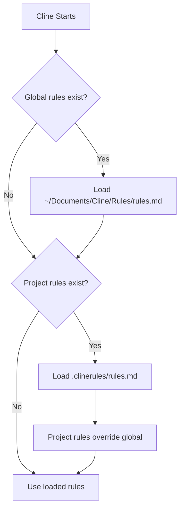

# Cline GitLab Workflow Kit

**AI-assisted GitLab MR workflows** with automatic status checks, MR updates, and code quality tracking.

Works with: GitLab + SonarQube + Cline (VS Code extension)

---

## ⚡ Quick Start (10 minutes)

### 1) Install MCP Servers

```bash
pip install uv
uv pip install python-gitlab-mcp sonar-mcp
```

### 2) Install Workflows Globally (Recommended)

```bash
# Clone temporarily
git clone https://github.com/siwardean/cline-workflow.git
cd cline-workflow

# Install globally (works for ALL projects)
mkdir -p ~/Documents/Cline/Rules
mkdir -p ~/Documents/Cline/Workflows
cp .clinerules/rules.md ~/Documents/Cline/Rules/
cp .clinerules/workflows/* ~/Documents/Cline/Workflows/

# Cleanup
cd .. && rm -rf cline-workflow
```

### 3) Configure MCP Servers in VS Code

**Option A: Using Cline UI (Recommended)**
1. Open VS Code → Cline extension
2. Click **Settings** (gear icon) → **MCP Servers**
3. Add servers using the UI

**Option B: Edit JSON Directly**

Open Cline settings and add to `cline_mcp_settings.json`:

```json
{
  "mcpServers": {
    "gitlab": {
      "command": "python-gitlab-mcp",
      "args": [],
      "env": {
        "GITLAB_URL": "https://gitlab.company.tld",
        "GITLAB_TOKEN": "your-personal-access-token-here",
        "GITLAB_ALLOWED_PROJECT_IDS": "12345,67890"
      }
    },
    "sonarqube": {
      "command": "sonar-mcp",
      "args": [],
      "env": {
        "SONAR_URL": "https://sonar.company.tld",
        "SONAR_TOKEN": "your-sonar-token-here"
      }
    }
  }
}
```

**Get your tokens:**
- **GitLab**: Settings → Access Tokens → Scope: `api`
- **SonarQube**: My Account → Security → Generate Token

**⚠️ Never commit tokens!**

### 4) Configure Your Project

Create `memory-bank/current-mr.md` in your GitLab project:

```yaml
# Current MR Configuration
# ⚠️ UPDATE THESE VALUES FOR YOUR PROJECT ⚠️

base_branch: main
feature_branch: feature/my-feature

# GitLab project configuration
project_id: 12345
mr_iid: 67

# SonarQube configuration
sonar_project_key: my-project

# MR template path (relative to repo root)
mr_template_path: .gitlab/merge_request_templates/default_merge_request.md

# Pre-commit hook runner (optional)
# Options: "lint-staged" | "pre-commit" | "both" | null
precommit_runner: null
```

### 5) Test It!

Open your project in VS Code and say to Cline:

```
Run the morning.md workflow
```

You should see MR threads, pipeline status, and SonarQube results!

---

## 📋 Available Workflows

| Workflow | Command | What it does |
|----------|---------|--------------|
| **morning.md** | `Run the morning.md workflow` | Check MR status, threads, SonarQube |
| **eod.md** | `Run the eod.md workflow` | Update MR, draft replies, write handover |
| **commit.md** | `Run the commit.md workflow` | Stage, test, propose commit message |
| **start.md** | `Run the start.md workflow` | Create plan from user story |
| **close.md** | `Run the close.md workflow` | Write retrospective after merge |

---

## 🔄 How Cline Finds Workflows



**Global Location:** `~/Documents/Cline/Rules/` and `~/Documents/Cline/Workflows/`  
**Project Location:** `.clinerules/` (optional - for customization)

---

## 🏗️ File Structure

### Global Setup (Recommended)
```
~/Documents/Cline/               ← Install once, use everywhere
├── Rules/
│   └── rules.md
└── Workflows/
    ├── morning.md
    ├── eod.md
    ├── commit.md
    ├── start.md
    └── close.md
```

### Per Project (Required)
```
your-gitlab-project/
└── memory-bank/
    └── current-mr.md            ← Only this file needed per project!
```

### Optional: Project-Specific Customization
```
your-gitlab-project/
├── .clinerules/                 ← Add only if you need custom workflows
│   ├── rules.md
│   └── workflows/
└── memory-bank/
    └── current-mr.md
```

---

## 🛠️ Troubleshooting

### "Cline can't find workflows"

**Check global location:**
```bash
ls ~/Documents/Cline/Rules/
ls ~/Documents/Cline/Workflows/
```

Should see `rules.md` and workflow files. If not, reinstall (see step 2).

### "Can't access GitLab MR"

1. Verify MCP configuration in Cline settings
2. Check `memory-bank/current-mr.md` has correct `project_id` and `mr_iid`
3. Verify GitLab token has `api` scope
4. Run: `python validate_mcp_setup.py`

### "SonarQube data not showing"

1. Verify `SONAR_URL` and `SONAR_TOKEN` in Cline MCP settings
2. Check `sonar_project_key` in `memory-bank/current-mr.md`
3. Run: `python validate_mcp_setup.py`

### "MCP servers not working"

Test MCP server commands manually:
```bash
# Test GitLab MCP
python-gitlab-mcp --version

# Test SonarQube MCP
sonar-mcp --version
```

If errors, reinstall:
```bash
uv pip install --upgrade python-gitlab-mcp sonar-mcp
```

---

## 📚 Documentation

- **[USER_GUIDE.md](USER_GUIDE.md)** - Complete walkthrough with examples (15 min read)
- **[docs/quick-reference.md](docs/quick-reference.md)** - Cheat sheet
- **[docs/workflow-examples.md](docs/workflow-examples.md)** - Real scenarios
- **[CHANGELOG.md](CHANGELOG.md)** - Release notes

---

## 🔧 MCP Servers Used

### python-gitlab-mcp
- **Project**: https://github.com/wadew/gitlab-mcp
- **Purpose**: Read MR threads, check pipelines, update MR descriptions
- **Install**: `uv pip install python-gitlab-mcp`

### sonar-mcp
- **Project**: https://github.com/wadew/sonar-mcp
- **Purpose**: Check quality gates, get coverage, list issues
- **Install**: `uv pip install sonar-mcp`

---

## ⚙️ Advanced Configuration

### Using Both Global + Project-Specific

**Global** (`~/Documents/Cline/`): Common workflows for all projects  
**Project** (`.clinerules/`): Project-specific overrides

When both exist: **Project rules override global rules**

### Pre-commit Hooks

Edit `memory-bank/current-mr.md`:
```yaml
precommit_runner: "lint-staged"  # or "pre-commit" or "both"
```

Commit workflow will automatically run hooks before committing.

### Custom MR Templates

Create `.gitlab/merge_request_templates/default_merge_request.md` in your project.  
EOD workflow uses this template when updating MR descriptions.

---

## 📝 Conventional Commits

All commits use Angular Conventional Commits format:

```
<type>(<scope>): <subject>

<body>

<footer>
```

**Types**: `feat`, `fix`, `docs`, `style`, `refactor`, `perf`, `test`, `build`, `ci`, `chore`

**Example:**
```
feat(auth): add password strength validator

Validates password strength based on length and character types.
Returns weak/medium/strong rating.
```

---

## 🤝 Contributing

Found an issue? Have a suggestion?

1. Create an issue: https://github.com/siwardean/cline-workflow/issues
2. Submit a PR
3. Share your workflow customizations

---

## 📄 License

MIT License - See [LICENSE](LICENSE) file

---

## 🙏 Credits

Built for teams using:
- **Cline** - AI coding assistant for VS Code
- **GitLab** - Source control & MR management
- **SonarQube** - Code quality & security

MCP servers by [wadew](https://github.com/wadew):
- python-gitlab-mcp
- sonar-mcp
