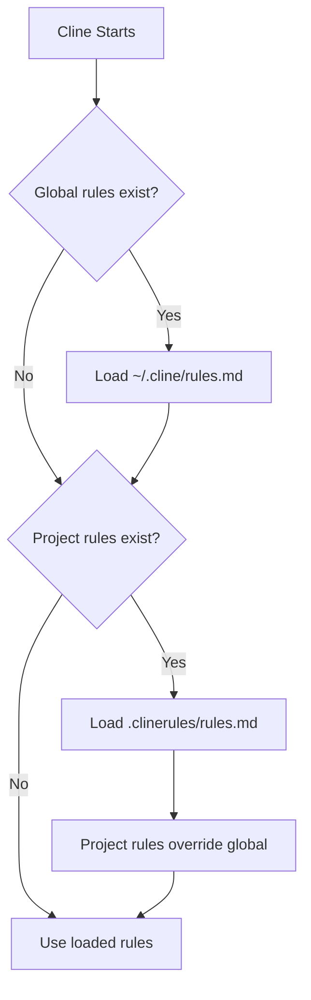

# Cline Development Workflow Kit with GitLab And SonarQube

A minimal, **workflow-driven** setup for using Cline with:
- GitLab Merge Requests (via local GitLab MCP)
- SonarQube (via local Sonar MCP)
- Daily **morning** planning and **EOD** MR updates
- Reviewer thread tracking + draft replies
- Angular Conventional Commits for semantic-release
- Clean Code + tests/coverage + SonarQube quality gates
- Project contribution governance

---

## 👋 New to AI Coding Assistants?

**Welcome!** If you've never used an AI agent like Cline before, don't worry - it's easier than you think!

**Think of Cline as your helpful pair programmer** who:
- ✅ Never gets tired of checking SonarQube
- ✅ Loves writing commit messages
- ✅ Remembers to update your MR description
- ✅ Keeps track of reviewer comments for you

**You're still in charge!** You write the features, make the decisions. Cline just handles the tedious stuff.

### 📚 Learning Resources

**Start here:**
- **[User Guide](USER_GUIDE.md)** - Step-by-step walkthrough of your first feature (15 min read)
- **[Quick Reference](docs/quick-reference.md)** - Cheat sheet for common tasks (keep it handy!)
- **[Workflow Examples](docs/workflow-examples.md)** - See real examples of each workflow in action

**Quick Examples:**

| You say to Cline | What happens |
|------------------|--------------|
| `Run the morning.md workflow` | Shows you MR status, reviewer comments, SonarQube results |
| `Run the commit.md workflow` | Runs tests, proposes commit message, commits if you approve |
| `Run the eod.md workflow` | Updates your MR, drafts replies to reviewers |

**Your first command:** Just say "Run the morning.md workflow" and Cline will check your MR status!

---

## Folder structure

### **Option A: Project-Specific Setup**

All files in your **project root** (workspace root directory):

```
your-project/              ← Open this folder in VS Code
├── .clinerules/           ← Cline reads automatically from here
│   ├── rules.md           ← Workspace rules & standards
│   └── workflows/
│       ├── start.md       # Start a new feature from user story
│       ├── morning.md     # Daily status check (threads, SonarQube, pipeline)
│       ├── eod.md         # Update MR & draft reviewer replies
│       ├── commit.md      # Stage, test, commit with conventional message
│       └── close.md       # Post-merge retrospective
│
├── memory-bank/           ← Project state & configuration
│   ├── current-mr.md      # Your project configuration (update this first!)
│   ├── handover.md        # Daily progress tracker
│   ├── story.md           # Feature plan
│   └── retro.md           # Retrospective after merge
│
├── docs/                  ← Reference documentation
│   ├── quick-reference.md    # Cheat sheet for common tasks
│   └── workflow-examples.md  # Real examples of each workflow
│
├── .gitlab/
│   └── merge_request_templates/
│       └── default.md     # MR description template
│
├── README.md              ← You are here
├── USER_GUIDE.md          ← Start here for beginners
├── CHANGELOG.md           ← Release notes
└── validate_mcp_setup.py  ← Setup validation script
```

### **Option B: Global Setup**

Files in your **home directory** (applies to all projects):

```
~/.cline/                  ← Your home directory (all platforms)
├── rules.md               ← Global rules
└── workflows/             ← Global workflows
    ├── start.md
    ├── morning.md
    ├── eod.md
    ├── commit.md
    └── close.md
```

**💡 Tip:** 
- **Project-specific**: When you open a project folder in VS Code, Cline reads `.clinerules/rules.md` from that project
- **Global**: Cline always reads `~/.cline/rules.md` (if it exists) for all projects
- **Both**: Use both! Project rules override global rules

## MCP servers used by this project

This project relies on **local MCP (Model Context Protocol) servers** so Cline can interact with enterprise GitLab and SonarQube instances even when an official MCP endpoint is not available/enabled.

### GitLab MCP (local, Python)
- Project: https://github.com/wadew/gitlab-mcp
- Purpose in this kit:
  - read MR discussions/threads (with conversation history)
  - check pipeline status / jobs
  - update MR description (from repo MR template)
  - draft replies to remediated review threads

### SonarQube MCP (local, Python)
- Project: https://github.com/wadew/sonar-mcp
- Purpose in this kit:
  - check quality gate status
  - list bugs/vulnerabilities/code smells
  - read coverage metrics (overall and per-file)

> Notes for enterprise setups: you typically want branch/MR context (not only main branch). This kit’s workflows are written so the agent can use MCP tool schema discovery if your SonarQube parameters differ by installation.

---

## 🚀 Quick Start (5 minutes)

### 0) Understanding File Locations

You have **two setup options** for `.clinerules/`:

#### **Option A: Project-Specific** (Recommended for Teams)
```
your-project/                    ← Open this folder in VS Code
├── .clinerules/                 ← Project workflows
│   ├── rules.md
│   └── workflows/
├── memory-bank/
└── ...
```

**Benefits:**
- ✅ Committed to git → entire team uses same workflows
- ✅ Customized per project → different projects can have different processes
- ✅ Version controlled → changes are tracked
- ✅ Great for team collaboration

#### **Option B: Global** (Personal Defaults)
```
~/.cline/                        ← Your home directory (all platforms)
├── rules.md                     ← Global rules
└── workflows/                   ← Global workflows
    ├── morning.md
    ├── eod.md
    └── ...
```

**Benefits:**
- ✅ Applies to all your projects automatically
- ✅ Personal productivity patterns
- ✅ No setup needed per project
- ✅ Great for solo developers

#### **Which Should You Use?**

| Use Case | Recommendation |
|----------|---------------|
| Working with a team | Project-specific (Option A) |
| Solo developer | Global (Option B) or Project-specific |
| Want to share workflows | Project-specific (commit to git) |
| Personal patterns across all projects | Global (Option B) |
| Mix of both | Both! (project overrides global) |

#### **How Cline Discovers Rules**



**Key Point:** Cline reads global first (`~/.cline/`), then project-specific (`.clinerules/`). Project rules override global rules.

### 1) Clone the repository
```bash
# Clone from your GitLab/GitHub instance
git clone https://gitlab.company.tld/<your-org>/<your-repo>.git
cd <your-repo>

# IMPORTANT: Open this directory in VS Code
# Cline will automatically find .clinerules/ here
```

### 1.5) Choose Your Setup Approach

**Quick Decision Guide:**

Answer these questions:
1. Are you working with a team? **→ Use Project-Specific (Option A)**
2. Do you want to share these workflows? **→ Use Project-Specific (Option A)**
3. Are you a solo developer? **→ Use Global (Option B) or Project-Specific**
4. Want workflows across all your projects? **→ Use Global (Option B)**

**If using Global setup (Option B):**
```bash
# Create global Cline directory
mkdir -p ~/.cline/workflows

# Copy workflows to global location
cp -r .clinerules/* ~/.cline/

# Copy memory-bank template (optional)
cp -r memory-bank ~/.cline/
```

**If using Project-Specific (Option A):**
- Skip the above - files are already in the project!
- Continue with the steps below

**Using Both?**
- Keep common patterns in `~/.cline/` (global)
- Keep project-specific rules in `.clinerules/` (project)
- Project rules will override global rules

### 2) Create and activate a virtual environment (recommended)
```bash
pip install uv
uv venv .venv

# macOS/Linux
source .venv/bin/activate

# Windows (PowerShell)
. .\.venv\Scripts\Activate.ps1
```

### 3) Install MCP servers
```bash
uv pip install gitlab-mcp sonar-mcp
```

### 4) Create API tokens
**GitLab**
- Create a Personal Access Token (PAT)
- Scope: `api`

**SonarQube**
- Create a Sonar token with permission to browse issues/metrics

⚠️ Never commit these tokens.

### 5) Configure MCP servers in Cline
In **Cline → MCP Servers**, add:

**GitLab MCP**
- Command: `gitlab-mcp`
- Environment variables:
  ```text
  GITLAB_URL=https://gitlab.company.tld
  GITLAB_TOKEN=xxxxxxxx
  GITLAB_ALLOWED_PROJECT_IDS=12345
  ```

**SonarQube MCP**
- Command: `sonar-mcp`
- Environment variables:
  ```text
  SONAR_URL=https://sonar.company.tld
  SONAR_TOKEN=xxxxxxxx
  ```

Restart Cline after adding servers.

### 6) Fill project metadata
Edit `memory-bank/current-mr.md`:

```md
base_branch: main
feature_branch: my-feature

project_id: 12345
mr_iid: 67

sonar_project_key: my-project

mr_template_path: .gitlab/merge_request_templates/default.md

precommit_runner: null  # or "lint-staged" | "pre-commit" | "both"
```

### 7) Validate your setup (optional but recommended)
```bash
python validate_mcp_setup.py
```

This checks:
- Project structure
- Memory bank configuration
- MCP package installation
- GitLab/SonarQube environment variables (if running in Cline)

### 8) Run your first workflow

**Make sure you've opened the project folder in VS Code** (not just individual files).

In Cline, run:
```
Run the morning.md workflow
```

If you see MR thread summaries and quality signals → you're ready!

**Troubleshooting:**
- ❌ "Cline can't find the workflow" → Check that `.clinerules/` is in your workspace root
- ❌ "Rules not being followed" → Verify you opened the **project folder** in VS Code, not a parent directory
- ✅ Check: Look at VS Code's sidebar - you should see `.clinerules/` folder at the root level

---

## 💡 How to Use This Kit (Day-to-Day)

### Typical Day with Cline

**Morning (2 minutes):**
```
You: Run the morning.md workflow

Cline: [Shows MR status, reviewer comments, SonarQube results, suggests priorities]
```

**While Coding:**
```
You: Let's implement the password validation function

Cline: [Writes code, creates tests, runs them]

You: Looks good! Run the commit.md workflow

Cline: [Stages changes, runs hooks, proposes commit message, commits if approved]
```

**End of Day (2 minutes):**
```
You: Run the eod.md workflow

Cline: [Updates MR description, drafts replies to reviewer threads, updates handover]
```

**Total time saved per day: 30-60 minutes** ⏰

### Real Example: Your First Conversation

**You:** `Run the morning.md workflow`

**Cline responds:**
```
🔍 Checking MR !67...

GitLab Status:
- Pipeline: ✅ PASSING
- Threads: 2 unresolved

Thread #1: "Can you add error handling here?"
Thread #2: "Missing tests for edge case"

SonarQube: ✅ Quality Gate PASSED
Coverage: 85.2%

Today's priorities:
1. Add error handling (Thread #1)
2. Add edge case tests (Thread #2)

Ready to start with Thread #1?
```

**You:** `Yes, let's fix the error handling`

**Cline:** `[Reads the file, adds try-catch, updates tests, shows you the diff]`

**You:** `Perfect! Run the commit.md workflow`

**See? Easy!** Check [USER_GUIDE.md](USER_GUIDE.md) for complete walkthroughs.

---

## ✅ MCP validation & troubleshooting

### Quick validation
Run the validation script to check your setup:

```bash
python validate_mcp_setup.py
```

### Manual validation

### Validate GitLab MCP
In Cline:
- Ask it to **list available GitLab MCP tools**
- Then ask it to **fetch MR !<mr_iid> metadata**

If it fails:
- verify `GITLAB_URL`
- PAT scope = `api`
- correct `project_id` and `mr_iid`
- ensure `GITLAB_ALLOWED_PROJECT_IDS` includes your project

### Validate SonarQube MCP
In Cline:
- Ask it to **list available Sonar MCP tools**
- Then ask it to **get quality gate status** for your project (branch/MR context if needed)

If it fails:
- verify `SONAR_URL`
- Sonar token permissions
- confirm your project key exists in SonarQube

---

## Workflows (run in Cline)

Just say **"Run the [workflow-name] workflow"** in Cline:

| Workflow | When to use | What it does |
|----------|-------------|--------------|
| `start.md` | Beginning of feature | Paste Rally story → generates execution plan |
| `morning.md` | Start of day | Shows MR threads, pipeline, SonarQube status, priorities |
| `eod.md` | End of day | Updates MR description, drafts reviewer replies, writes handover |
| `commit.md` | After coding | Stages changes, runs hooks, proposes commit message |
| `close.md` | After MR merges | Creates retrospective comparing plan vs reality |

**Example:** Type `Run the morning.md workflow` in Cline and hit enter! 🚀

📖 **See detailed examples:** [docs/workflow-examples.md](docs/workflow-examples.md)

---

## Contributing / Development workflow (enforced by EOD)

### Commits (Conventional Commits)
This repository uses **semantic-release** to generate changelogs and manage versioning.
Commits must follow **Angular Conventional Commits**:

`<type>(<scope>): <subject>`

Common types: `feat`, `fix`, `docs`, `style`, `refactor`, `perf`, `test`, `build`, `ci`, `chore`, `revert`.

### Merge Request overview
MR descriptions must be based on the repository’s **default MR template** and filled out accurately.

### Merge Requests (reviews & threads)
When a thread is remediated, reply with:
- what changed
- where (file/module)
- how to verify (tests/commands)
…and request the reviewer to confirm and resolve the thread.

### Quality gates (tests, coverage, SonarQube)
- All functional changes must include or update automated tests.
- Avoid reducing coverage without justification.
- CI runs SonarQube analysis; new issues introduced by the MR must be fixed and quality gate must pass.

---

## ❓ FAQ & Troubleshooting

### "Where do these files go?"

**You have two options:**

**Option A: Project-Specific** (in your project folder)
```
your-project/          ← Open THIS folder in VS Code
├── .clinerules/       ← Project workflows
├── memory-bank/
└── ...
```

**Option B: Global** (in your home directory)
```
~/.cline/              ← Applies to all projects
├── rules.md
└── workflows/
```

**Cline reads global first, then project-specific. Project rules override global.**

**Not working?**
- **Project setup:** Check VS Code's file explorer - is `.clinerules/` at the top level?
- **Global setup:** Check `~/.cline/` exists in your home directory
- Did you open the project **folder**, not a subdirectory?
- Try restarting VS Code after setup

### "Should I use global or project-specific setup?"

**Use Project-Specific if:**
- ✅ You're working with a team
- ✅ You want to share workflows (commit to git)
- ✅ Different projects need different workflows
- ✅ You want version control for workflow changes

**Use Global if:**
- ✅ You're a solo developer
- ✅ You want the same workflows across all projects
- ✅ You have personal productivity patterns
- ✅ You don't want to set up per project

**Use Both if:**
- ✅ You want global defaults with project-specific overrides
- ✅ You have common patterns + project-specific rules
- ✅ You want flexibility

**Pro tip:** Start with global for personal use, add project-specific when working with teams.

### "How do I talk to Cline?"

Just type naturally in the Cline chat window:
- ✅ "Run the morning.md workflow"
- ✅ "Show me unresolved MR threads"
- ✅ "Help me fix the SonarQube bug"
- ✅ "Let's implement the password validator"

### "What if Cline doesn't understand me?"

Be more specific:
- ❌ "Fix it" → ✅ "Fix the null pointer bug in AuthService.ts line 45"
- ❌ "Update MR" → ✅ "Run the eod.md workflow"

### "Cline can't see my MR threads"

1. Run `python validate_mcp_setup.py`
2. Check `memory-bank/current-mr.md`:
   - Is `project_id` correct?
   - Is `mr_iid` correct?
3. Verify GitLab MCP in Cline settings:
   - `GITLAB_TOKEN` has `api` scope
   - `GITLAB_ALLOWED_PROJECT_IDS` includes your project

### "SonarQube data isn't showing"

1. Run `python validate_mcp_setup.py`
2. Check SonarQube MCP configuration:
   - `SONAR_URL` correct?
   - `SONAR_TOKEN` valid?
3. Verify `sonar_project_key` in `memory-bank/current-mr.md`

### "Pre-commit hooks aren't running"

Edit `memory-bank/current-mr.md` and set:
```yaml
precommit_runner: "lint-staged"  # or "pre-commit" or "both"
```

### "I made a mistake, how do I undo?"

Just tell Cline:
```
Undo that last change
```

Or use git:
```
git restore <filename>
```

### "Where can I learn more?"

- **[User Guide](USER_GUIDE.md)** - Complete walkthrough with examples
- **[Quick Reference](docs/quick-reference.md)** - Cheat sheet
- **[Workflow Examples](docs/workflow-examples.md)** - Real scenario examples

### "Can I customize the workflows?"

**Yes!** Workflows are just markdown files in `.clinerules/workflows/`. Edit them to match your team's process.

### "What if I'm stuck?"

Ask Cline:
```
I'm stuck. Can you explain what I should do next?
```

Cline can explain itself and help you get unstuck!

---

## 📦 Public GitHub release checklist

### Documentation
- [ ] README includes Quick Start + MCP setup + workflow overview + beginner section
- [ ] User guide with step-by-step examples (`USER_GUIDE.md`)
- [ ] Quick reference cheat sheet (`docs/quick-reference.md`)
- [ ] Workflow examples with real scenarios (`docs/workflow-examples.md`)
- [ ] No internal URLs or tokens
- [ ] Enterprise assumptions are clear
- [ ] FAQ/Troubleshooting section complete

### Repository hygiene
- [ ] `.clinerules/` committed
- [ ] `memory-bank/` committed with templates only (with configuration markers)
- [ ] `.gitlab/merge_request_templates/` committed
- [ ] `.gitignore` covers `.venv/`, `.env`, etc.
- [ ] `validate_mcp_setup.py` script included

### Workflow sanity
- [ ] `/start.md` works with pasted story
- [ ] `/morning.md` runs without modifying files
- [ ] `/eod.md` updates MR description and creates thread reply drafts
- [ ] `/commit.md` requires explicit approval
- [ ] `validate_mcp_setup.py` runs successfully

### Security
- [ ] Tokens are environment-only
- [ ] GitLab MCP uses project allowlist
- [ ] Sonar MCP token is least-privilege (read where possible)

### Licensing
- [ ] Add a `LICENSE` file (MIT/Apache-2.0 recommended)
- [ ] Verify MCP server licenses are compatible

---

## 🤝 Getting Help & Contributing

### New to this?
Start with [USER_GUIDE.md](USER_GUIDE.md) - it walks you through everything step-by-step!

### Quick help
- **[Quick Reference](docs/quick-reference.md)** - Cheat sheet for common tasks
- **[Workflow Examples](docs/workflow-examples.md)** - See real examples
- **[FAQ](#-faq--troubleshooting)** - Common questions answered

### Contributing
Contributions welcome! This is an open-source template designed to be customized. Feel free to:
- Add new workflows for your team's processes
- Improve documentation with your learnings
- Share your customizations via PRs
- Report issues or suggest improvements

### Questions?
**Just ask Cline!** Seriously:
```
Can you explain how this workflow kit works?
```

Cline can read all these docs and explain them to you! 🤖
