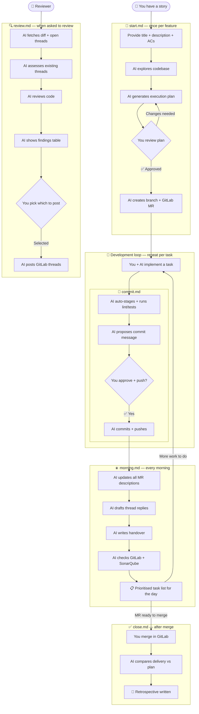
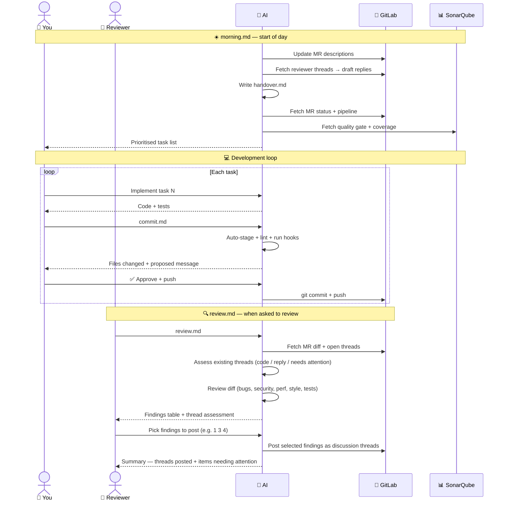

# AI-Assisted Workflows for Agile Developers

Stop managing branches, MRs, and status checks manually. These AI workflows handle the entire feature lifecycle — from user story to post-merge retrospective.

Works with **Claude Code** · **Cline** · **Kilo Code** · **Cursor** · **OpenCode** — any MCP-compatible AI assistant.

---

## Feature Lifecycle


```mermaid
flowchart TD
    A([👤 You have a story]) --> B

    subgraph S["🚀 start.md — once per feature"]
        B[Provide title + description + ACs] --> C[AI explores codebase]
        C --> D[AI generates execution plan]
        D --> E{You review plan}
        E -->|Changes needed| D
        E -->|✅ Approved| F[AI creates branch + GitLab MR]
    end

    F --> G

    subgraph LOOP["🔁 Development loop — repeat per task"]
        G[You + AI implement a task] --> H
        subgraph COMMIT["📝 commit.md"]
            H[AI auto-stages + runs lint/tests] --> I[AI proposes commit message]
            I --> J{You approve + push?}
            J -->|✅ Yes| K[AI commits + pushes]
        end
    end

    K --> L
    REVIEWER([👤 Reviewer]) --> RA

    subgraph REVIEW["🔍 review.md — when asked to review"]
        RA[AI fetches diff + open threads] --> RB[AI assesses existing threads]
        RB --> RC[AI reviews code]
        RC --> RD[AI shows findings table]
        RD --> RE{You pick which to post}
        RE -->|Selected| RF[AI posts GitLab threads]
    end

    subgraph MORNING["☀️ morning.md — every morning"]
        L[AI updates all MR descriptions] --> M[AI drafts thread replies]
        M --> N[AI writes handover]
        N --> O[AI checks GitLab + SonarQube]
        O --> P[📋 Prioritised task list for the day]
    end

    P -->|More work to do| G
    P -->|MR ready to merge| Q

    subgraph CLOSE["✅ close.md — after merge"]
        Q[You merge in GitLab] --> R[AI compares delivery vs plan]
        R --> T[📄 Retrospective written]
    end
```

---

## Workflows

| Workflow | When | You provide | AI does |
|---|---|---|---|
| **start.md** | New feature | Story title, description, ACs | Plan → branch → MR |
| **morning.md** | Every morning | Nothing | Wrap up yesterday + status check |
| **commit.md** | After code changes | Approve message + push | Auto-stage → lint → single approval → push |
| **review.md** | When asked to review an MR | Which findings to post | Diff review → thread assessment → post threads |
| **close.md** | After MR merged | Nothing | Retrospective |

### Daily Developer Flow


```mermaid
sequenceDiagram
    actor Dev as 👤 You
    actor Rev as 👤 Reviewer
    participant AI as 🤖 AI
    participant GL as 🦊 GitLab
    participant SQ as 📊 SonarQube

    Note over Dev,SQ: ☀️ morning.md — start of day

    AI->>GL: Update MR descriptions
    AI->>GL: Fetch reviewer threads → draft replies
    AI->>AI: Write handover.md
    AI->>GL: Fetch MR status + pipeline
    AI->>SQ: Fetch quality gate + coverage
    AI-->>Dev: Prioritised task list

    Note over Dev,SQ: 💻 Development loop

    loop Each task
        Dev->>AI: Implement task N
        AI-->>Dev: Code + tests
        Dev->>AI: commit.md
        AI->>AI: Auto-stage + lint + run hooks
        AI-->>Dev: Files changed + proposed message
        Dev->>AI: ✅ Approve + push
        AI->>GL: git commit + push
    end

    Note over Rev,GL: 🔍 review.md — when asked to review

    Rev->>AI: review.md
    AI->>GL: Fetch MR diff + open threads
    AI->>AI: Assess existing threads (code / reply / needs attention)
    AI->>AI: Review diff (bugs, security, perf, style, tests)
    AI-->>Rev: Findings table + thread assessment
    Rev->>AI: Pick findings to post (e.g. 1 3 4)
    AI->>GL: Post selected findings as discussion threads
    AI-->>Rev: Summary — threads posted + items needing attention
```

---

## Setup

```bash
git clone https://github.com/siwardean/cline-workflow.git
cd cline-workflow
python install.py
```

The installer walks you through everything interactively:

| Step | What it does |
|---|---|
| 1 | Installs `python-gitlab-mcp` and `sonar-mcp` via uv or pip |
| 2 | Copies workflow files to the right location for your tool(s) |
| 3 | Writes MCP credentials into your tool's config file |
| 4 | Creates `memory-bank/current-mr.md` in your project |
| 5 | Runs `validate_mcp_setup.py` to confirm everything works |

Get tokens before running: GitLab → Settings → Access Tokens (scope: `api`) · SonarQube → My Account → Security.

<details>
<summary>Manual setup (if you prefer)</summary>

**Install packages:**
```bash
uv pip install python-gitlab-mcp sonar-mcp
```

**Copy workflows for your tool:**

| Tool | Command |
|---|---|
| Claude Code | `cp CLAUDE.md /your-project/ && cp -r .claude /your-project/` |
| Cline | `cp .clinerules/rules.md ~/Documents/Cline/Rules/ && cp .clinerules/workflows/* ~/Documents/Cline/Workflows/` |
| Kilo Code | `cp .kilocoderules/rules.md ~/Documents/KiloCode/Rules/ && cp .kilocoderules/workflows/* ~/Documents/KiloCode/Workflows/` |
| Cursor | `cp -r .cursor /your-project/` |
| OpenCode | `cp -r .clinerules /your-project/` |

**Add MCP config** to your tool's settings file:

```json
{
  "mcpServers": {
    "gitlab": {
      "command": "python-gitlab-mcp",
      "env": { "GITLAB_URL": "...", "GITLAB_TOKEN": "...", "GITLAB_ALLOWED_PROJECT_IDS": "..." }
    },
    "sonarqube": {
      "command": "sonar-mcp",
      "env": { "SONAR_URL": "...", "SONAR_TOKEN": "..." }
    }
  }
}
```

| Tool | MCP config location |
|---|---|
| Claude Code | `~/.claude/settings.json` |
| Cline | VS Code → Cline → Settings → MCP Servers → Edit JSON |
| Kilo Code | VS Code → Kilo Code → Settings → MCP Servers → Edit JSON |
| Cursor | `.cursor/mcp.json` in project root |
| OpenCode | `~/.config/opencode/config.json` |

</details>

### Try it

**Claude Code:**
```
/morning
/commit
/review
```

**All other tools:**
```
Run the morning.md workflow
Run the commit.md workflow
Run the review.md workflow
```

---

## Troubleshooting

**AI can't find workflows** — verify install paths:
```bash
ls .claude/commands/               # Claude Code
ls ~/Documents/Cline/Workflows/    # Cline
ls ~/Documents/KiloCode/Workflows/ # Kilo Code
```

**GitLab or SonarQube not connecting** — validate your setup:
```bash
python validate_mcp_setup.py
```

**Token errors** — ensure GitLab token has `api` scope and is not expired.

---

## MCP Servers

- [python-gitlab-mcp](https://github.com/wadew/gitlab-mcp) — reads/updates MRs, threads, pipelines
- [sonar-mcp](https://github.com/wadew/sonar-mcp) — quality gate, coverage, issues

---

MIT License
