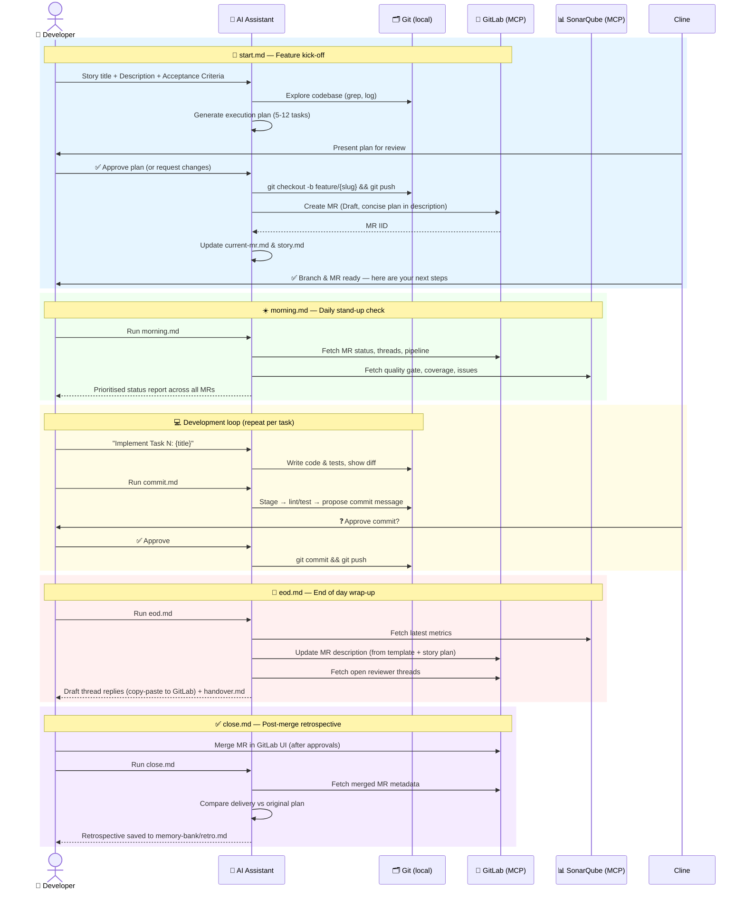

# AI-assisted workflows for Agile developers

**AI-assisted GitLab MR workflows** with automatic status checks, MR updates, and code quality tracking.

Works with: GitLab + SonarQube + **Cline** · **Kilo Code** · **Cursor** · **OpenCode** (any MCP-compatible AI assistant)

---

## 🗺️ How the Workflow Works

The diagram below shows the **full feature lifecycle** — what you type, what Cline does, and when each workflow runs.


```mermaid
sequenceDiagram
    actor Dev as 👤 Developer
    participant AI as 🤖 AI Assistant
    participant Git as 🗂️ Git (local)
    participant GL as 🦊 GitLab (MCP)
    participant SQ as 📊 SonarQube (MCP)

    rect rgb(230, 245, 255)
        Note over Dev,GL: 🚀 start.md — Feature kick-off
        Dev->>AI: Story title + Description + Acceptance Criteria
        AI->>Git: Explore codebase (grep, log)
        AI->>AI: Generate execution plan (5-12 tasks)
        Cline->>Dev: Present plan for review
        Dev->>AI: ✅ Approve plan (or request changes)
        AI->>Git: git checkout -b feature/{slug} && git push
        AI->>GL: Create MR (Draft, concise plan in description)
        GL-->>AI: MR IID
        AI->>AI: Update current-mr.md & story.md
        Cline->>Dev: ✅ Branch & MR ready — here are your next steps
    end

    rect rgb(240, 255, 240)
        Note over Dev,SQ: ☀️ morning.md — Daily stand-up check
        Dev->>AI: Run morning.md
        AI->>GL: Fetch MR status, threads, pipeline
        AI->>SQ: Fetch quality gate, coverage, issues
        AI-->>Dev: Prioritised status report across all MRs
    end

    rect rgb(255, 252, 230)
        Note over Dev,Git: 💻 Development loop (repeat per task)
        Dev->>AI: "Implement Task N: {title}"
        AI->>Git: Write code & tests, show diff
        Dev->>AI: Run commit.md
        AI->>Git: Stage → lint/test → propose commit message
        Cline->>Dev: ❓ Approve commit?
        Dev->>AI: ✅ Approve
        AI->>Git: git commit && git push
    end

    rect rgb(255, 240, 240)
        Note over Dev,SQ: 🌆 eod.md — End of day wrap-up
        Dev->>AI: Run eod.md
        AI->>SQ: Fetch latest metrics
        AI->>GL: Update MR description (from template + story plan)
        AI->>GL: Fetch open reviewer threads
        AI-->>Dev: Draft thread replies (copy-paste to GitLab) + handover.md
    end

    rect rgb(245, 235, 255)
        Note over Dev,GL: ✅ close.md — Post-merge retrospective
        Dev->>GL: Merge MR in GitLab UI (after approvals)
        Dev->>AI: Run close.md
        AI->>GL: Fetch merged MR metadata
        AI->>AI: Compare delivery vs original plan
        AI-->>Dev: Retrospective saved to memory-bank/retro.md
    end
```

**Key insight:** You only need to provide the user story — your AI assistant creates the branch, opens the MR, and manages all GitLab updates throughout the feature lifecycle.

---

## ⚡ Quick Start (10 minutes)

### 1) Install MCP Servers

```bash
pip install uv

# Option A: From requirements.txt (recommended)
uv pip install -r requirements.txt

# Option B: Direct install
uv pip install python-gitlab-mcp sonar-mcp
```

### 2) Install Workflows

Clone the repo, then copy files to your AI assistant's rules directory:

```bash
git clone https://github.com/siwardean/cline-workflow.git
cd cline-workflow
uv pip install -r requirements.txt
```

**Cline** — global install (works for all projects):
```bash
mkdir -p ~/Documents/Cline/Rules ~/Documents/Cline/Workflows
cp .clinerules/rules.md ~/Documents/Cline/Rules/
cp .clinerules/workflows/* ~/Documents/Cline/Workflows/
```

**Kilo Code** — global install:
```bash
mkdir -p ~/Documents/KiloCode/Rules ~/Documents/KiloCode/Workflows
cp .kilocoderules/rules.md ~/Documents/KiloCode/Rules/
cp .kilocoderules/workflows/* ~/Documents/KiloCode/Workflows/
```

**Cursor** — project-level (copy into each project):
```bash
# In your target project root:
cp -r /path/to/cline-workflow/.cursor ./
```
> Cursor loads `.cursor/rules/*.mdc` automatically. No global install needed.

**OpenCode** — project-level:
```bash
cp -r /path/to/cline-workflow/.clinerules ./
```
> OpenCode reads `.clinerules/` by default when present.

After installing, you can delete the cloned repo.

### 3) Configure MCP Servers

The MCP JSON config block is the same across tools — only the file location differs:

```json
{
  "mcpServers": {
    "gitlab": {
      "command": "python-gitlab-mcp",
      "args": [],
      "env": {
        "GITLAB_URL": "https://gitlab.company.tld",
        "GITLAB_TOKEN": "your-personal-access-token-here",
        "GITLAB_ALLOWED_PROJECT_IDS": "12345,67890"
      }
    },
    "sonarqube": {
      "command": "sonar-mcp",
      "args": [],
      "env": {
        "SONAR_URL": "https://sonar.company.tld",
        "SONAR_TOKEN": "your-sonar-token-here"
      }
    }
  }
}
```

**Where to add it:**

| Tool | Config location |
|------|----------------|
| **Cline** | VS Code → Cline extension → Settings → MCP Servers → Edit JSON (`cline_mcp_settings.json`) |
| **Kilo Code** | VS Code → Kilo Code extension → Settings → MCP Servers → Edit JSON |
| **Cursor** | `.cursor/mcp.json` in project root OR `~/.cursor/mcp.json` globally |
| **OpenCode** | `~/.config/opencode/config.json` → `mcpServers` key |

**Get your tokens:**
- **GitLab**: Settings → Access Tokens → Scope: `api`
- **SonarQube**: My Account → Security → Generate Token

**⚠️ Never commit tokens to version control!**

### 4) Configure Your Project

Create `memory-bank/current-mr.md` in your GitLab project:

```yaml
# Current Project Configuration
# ⚠️ UPDATE THESE VALUES FOR YOUR PROJECT ⚠️

base_branch: main

# GitLab project configuration
project_id: 12345

# Merge Requests to track (supports MULTIPLE MRs!)
merge_requests:
  - mr_iid: 67
    feature_branch: feature/user-authentication
    description: "User authentication with JWT"
  
  - mr_iid: 68
    feature_branch: feature/password-reset
    description: "Password reset flow"
  
  # Add more MRs as needed

# SonarQube configuration
sonar_project_key: my-project

# MR template path
mr_template_path: .gitlab/merge_request_templates/default_merge_request.md

# Pre-commit hook runner (optional)
precommit_runner: null
```

**✨ New: Multi-MR Support!** Track and manage multiple merge requests in one project.

### 5) Test It!

Open your project and prompt your AI assistant:

```
Run the morning.md workflow
```

You should see status for **all your MRs**, including threads, pipeline status, and SonarQube results!

---

## 📋 Available Workflows

### **start.md** - Feature Planning + Branch + MR
**When**: Beginning of a new feature
**Input**: Story title, description, and acceptance criteria (just type them in chat)
**What it does:**
- ✅ Searches codebase for relevant files
- ✅ Creates execution plan with tasks mapped to acceptance criteria
- ✅ **Presents the plan for your review — nothing is created until you approve**
- ✅ Creates the git feature branch and pushes it
- ✅ Creates the GitLab MR (Draft) with the concise approved plan as description
- ✅ Writes full plan to `memory-bank/story.md`
- ✅ Updates `memory-bank/current-mr.md` with MR details

**What it does NOT do:**
- ❌ Does NOT create branch or MR without your plan approval
- ❌ Does NOT write production code

**Output**: Git branch pushed, GitLab MR opened, `memory-bank/story.md` written

---

### **morning.md** - Daily Status Check
**When**: Start of your workday  
**Input**: None (reads from `memory-bank/current-mr.md`)  
**What it does:**
- ✅ Fetches status for **ALL MRs** in your project
- ✅ Reads GitLab threads, pipeline status for each MR
- ✅ Fetches SonarQube quality gate, coverage, issues
- ✅ Prioritizes work across all MRs
- ✅ Suggests which MR to focus on

**What it does NOT do:**
- ❌ Does NOT modify any files
- ❌ Does NOT update GitLab
- ❌ Does NOT write code

**Output**: Status report in chat with prioritized task list

---

### **eod.md** - End of Day Update
**When**: Before you finish for the day  
**Input**: None (reads config, asks which MR to update)  
**What it does:**
- ✅ Shows all your active MRs
- ✅ Asks you which MR(s) to update
- ✅ Fetches latest SonarQube results
- ✅ Updates GitLab MR description (using MR template)
- ✅ Drafts replies to resolved reviewer threads (you copy/paste to GitLab)
- ✅ Updates `memory-bank/handover.md` with progress

**What it does NOT do:**
- ❌ Does NOT post replies to GitLab (shows drafts for you to post)
- ❌ Does NOT resolve threads
- ❌ Does NOT merge anything

**Output**: 
- Updated MR description on GitLab
- Draft thread replies (in chat, ready to copy)
- Updated `memory-bank/handover.md`

---

### **commit.md** - Commit Helper
**When**: After you've made code changes  
**Input**: Your code changes (staged or unstaged)  
**What it does:**
- ✅ Shows `git status` and `git diff`
- ✅ Stages changes (with your confirmation)
- ✅ Runs pre-commit hooks (lint, tests)
- ✅ Auto-fixes linting errors if possible
- ✅ Proposes Angular Conventional Commit message
- ✅ Commits **only after you approve**
- ✅ Pushes to remote

**What it does NOT do:**
- ❌ Does NOT commit without approval
- ❌ Does NOT write code
- ❌ Does NOT merge branches

**Output**: Committed and pushed changes with proper commit message

---

### **close.md** - Post-Merge Retrospective
**When**: After your MR is merged  
**Input**: None (reads merged MR data)  
**What it does:**
- ✅ Fetches merged MR metadata from GitLab
- ✅ Analyzes what changed vs original plan
- ✅ Evaluates acceptance criteria compliance
- ✅ Compares estimate vs actual time
- ✅ Identifies lessons learned
- ✅ Writes retrospective to `memory-bank/retro.md`

**What it does NOT do:**
- ❌ Does NOT merge the MR (you do that in GitLab)
- ❌ Does NOT modify code
- ❌ Does NOT update GitLab

**Output**: `memory-bank/retro.md` with detailed retrospective

---

## 🔄 Complete Feature Lifecycle (What YOU Do vs What the AI Does)

### **Phase 1: Setup** (One-time per project)
```bash
# Only one file needed per project — set your project_id and base_branch:
# Edit memory-bank/current-mr.md:
#   project_id: 12345
#   base_branch: main
```

That's it. **Your AI assistant handles the rest when you run start.md.**

### **Phase 2: Planning + Branch + MR** (AI Does It All)
```
You: Run the start.md workflow

Tell the AI:
  Story title: "Add password strength validator"
  Description: "Users need feedback on password strength during registration"
  Acceptance Criteria:
    1. Shows weak/medium/strong indicator
    2. Blocks form submit if weak
    3. Works on all modern browsers

AI:
- ✅ Searches codebase for relevant code
- ✅ Creates execution plan (5-12 tasks mapped to each AC)
- ✅ Presents plan for YOUR REVIEW

You: Approve the plan (or ask for changes)

AI:
- ✅ Creates branch: feature/add-password-strength-validator
- ✅ Pushes branch to origin
- ✅ Opens Draft MR on GitLab with concise plan in description
- ✅ Updates memory-bank/current-mr.md and memory-bank/story.md

Output: Branch + MR ready, full plan written — no GitLab UI needed
```

### **Phase 3: Development** (You + AI)
```
You: Let's implement Task 1 - password validation function

AI:
- ✅ Writes code
- ✅ Creates tests
- ✅ Shows you the implementation

You: [Review, provide feedback]

You: Run the commit.md workflow

AI:
- ✅ Shows diff
- ✅ Runs tests/lint
- ✅ Proposes commit message
- ❓ Asks for approval

You: Approve

AI:
- ✅ Commits
- ✅ Pushes
```

### **Phase 4: Daily Maintenance** (AI Automates)
```
Morning:
You: Run the morning.md workflow

AI:
- ✅ Shows status of ALL your MRs
- ✅ Lists reviewer threads
- ✅ Shows SonarQube issues
- ✅ Suggests priorities

Evening:
You: Run the eod.md workflow

AI:
- ✅ Asks which MR to update
- ✅ Updates MR description
- ✅ Drafts thread replies
- ✅ Updates handover

You: [Copy/paste replies to GitLab]
```

### **Phase 5: Merge & Close** (You + AI)
```
You: [Merge MR in GitLab UI after approvals]

You: Run the close.md workflow

AI:
- ✅ Analyzes what was delivered
- ✅ Compares to original plan
- ✅ Calculates time variance
- ✅ Writes retrospective

Output: memory-bank/retro.md with lessons learned
```

---

## 🎯 Quick Summary

| Action | Who Does It |
|--------|-------------|
| Provide story + acceptance criteria | **YOU** |
| Plan feature | **AI** (start.md) |
| Review & approve the plan | **YOU** |
| Create branch | **AI** (start.md, after your approval) |
| Create MR with plan in description | **AI** (start.md, via GitLab MCP) |
| Write code | **YOU + AI** (pair programming) |
| Commit code | **AI** (commit.md, with your approval) |
| Check daily status | **AI** (morning.md) |
| Update MR description | **AI** (eod.md) |
| Post thread replies | **YOU** (copy drafts from AI) |
| Merge MR | **YOU** (GitLab UI, after approvals) |
| Write retro | **AI** (close.md) |

**Bottom line:** You provide the story and review the plan — your AI assistant handles branch creation, MR setup, status checks, MR updates, commit messages, and retrospectives.

---

## 🔄 How the AI Finds Workflows

Each tool looks for rules files in different locations. The repo ships all three:

| Tool | Project rules dir | Global rules dir |
|------|------------------|-----------------|
| **Cline** | `.clinerules/` | `~/Documents/Cline/Rules/` |
| **Kilo Code** | `.kilocoderules/` | `~/Documents/KiloCode/Rules/` |
| **Cursor** | `.cursor/rules/*.mdc` | Cursor User Settings → Rules |
| **OpenCode** | `.clinerules/` | `~/.config/opencode/` |

Project-level rules always override global rules when both exist.

---

## 🏗️ File Structure

### Repo layout (all tools included)
```
cline-workflow/
├── .clinerules/                 ← Cline & OpenCode
│   ├── rules.md
│   └── workflows/
│       ├── morning.md
│       ├── eod.md
│       ├── commit.md
│       ├── start.md
│       └── close.md
├── .kilocoderules/              ← Kilo Code
│   ├── rules.md
│   └── workflows/
├── .cursor/
│   ├── rules/                   ← Cursor rules (.mdc)
│   │   ├── rules.mdc
│   │   ├── morning.mdc
│   │   ├── eod.mdc
│   │   ├── commit.mdc
│   │   ├── start.mdc
│   │   └── close.mdc
│   └── mcp.json                 ← Cursor MCP config template
└── memory-bank/
    └── current-mr.md            ← Per-project config (all tools)
```

### Global install (Cline)
```
~/Documents/Cline/               ← Install once, use for all projects
├── Rules/rules.md
└── Workflows/*.md
```

### Global install (Kilo Code)
```
~/Documents/KiloCode/
├── Rules/rules.md
└── Workflows/*.md
```

### Per Project (Required — all tools)
```
your-gitlab-project/
└── memory-bank/
    └── current-mr.md            ← Only this file needed per project!
```

---

## 🛠️ Troubleshooting

### "AI can't find workflows"

**Cline / Kilo Code — check global location:**
```bash
ls ~/Documents/Cline/Rules/      # Cline
ls ~/Documents/KiloCode/Rules/   # Kilo Code
```

Should see `rules.md` and workflow files. If not, reinstall (see step 2).

**Cursor** — check that `.cursor/rules/*.mdc` files have `alwaysApply: true` in their frontmatter.

### "Can't access GitLab MR"

1. Verify MCP configuration in your AI assistant's settings
2. Check `memory-bank/current-mr.md` has correct `project_id` and `mr_iid`
3. Verify GitLab token has `api` scope
4. Run: `python validate_mcp_setup.py`

### "SonarQube data not showing"

1. Verify `SONAR_URL` and `SONAR_TOKEN` in your MCP settings
2. Check `sonar_project_key` in `memory-bank/current-mr.md`
3. Run: `python validate_mcp_setup.py`

### "MCP servers not working"

Test MCP server commands manually:
```bash
# Test GitLab MCP
python-gitlab-mcp --version

# Test SonarQube MCP
sonar-mcp --version
```

If errors, reinstall:
```bash
uv pip install --upgrade python-gitlab-mcp sonar-mcp
```

---

## 📚 Documentation

- **[USER_GUIDE.md](USER_GUIDE.md)** - Complete walkthrough with examples (15 min read)
- **[docs/quick-reference.md](docs/quick-reference.md)** - Cheat sheet
- **[docs/workflow-examples.md](docs/workflow-examples.md)** - Real scenarios
- **[CHANGELOG.md](CHANGELOG.md)** - Release notes

---

## 🔧 MCP Servers Used

### python-gitlab-mcp
- **Project**: https://github.com/wadew/gitlab-mcp
- **Purpose**: Read MR threads, check pipelines, update MR descriptions
- **Install**: `uv pip install python-gitlab-mcp`

### sonar-mcp
- **Project**: https://github.com/wadew/sonar-mcp
- **Purpose**: Check quality gates, get coverage, list issues
- **Install**: `uv pip install sonar-mcp`

---

## ⚙️ Advanced Configuration

### Using Both Global + Project-Specific

**Global** (`~/Documents/Cline/` or `~/Documents/KiloCode/`): Common workflows for all projects
**Project** (`.clinerules/` / `.kilocoderules/` / `.cursor/rules/`): Project-specific overrides

When both exist: **Project rules override global rules**

### Pre-commit Hooks

Edit `memory-bank/current-mr.md`:
```yaml
precommit_runner: "lint-staged"  # or "pre-commit" or "both"
```

Commit workflow will automatically run hooks before committing.

### Custom MR Templates

Create `.gitlab/merge_request_templates/default_merge_request.md` in your project.  
EOD workflow uses this template when updating MR descriptions.

---

## 📝 Conventional Commits

All commits use Angular Conventional Commits format:

```
<type>(<scope>): <subject>

<body>

<footer>
```

**Types**: `feat`, `fix`, `docs`, `style`, `refactor`, `perf`, `test`, `build`, `ci`, `chore`

**Example:**
```
feat(auth): add password strength validator

Validates password strength based on length and character types.
Returns weak/medium/strong rating.
```

---

## 🤝 Contributing

Found an issue? Have a suggestion?

1. Create an issue: https://github.com/siwardean/cline-workflow/issues
2. Submit a PR
3. Share your workflow customizations

---

## 📄 License

MIT License - See [LICENSE](LICENSE) file

---

## 🙏 Credits

Built for teams using:
- **Cline** · **Kilo Code** · **Cursor** · **OpenCode** - MCP-compatible AI coding assistants
- **GitLab** - Source control & MR management
- **SonarQube** - Code quality & security

MCP servers by [wadew](https://github.com/wadew):
- python-gitlab-mcp
- sonar-mcp
