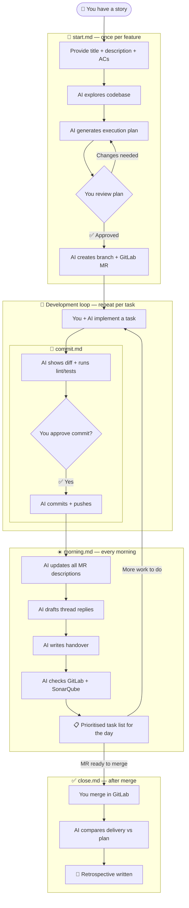
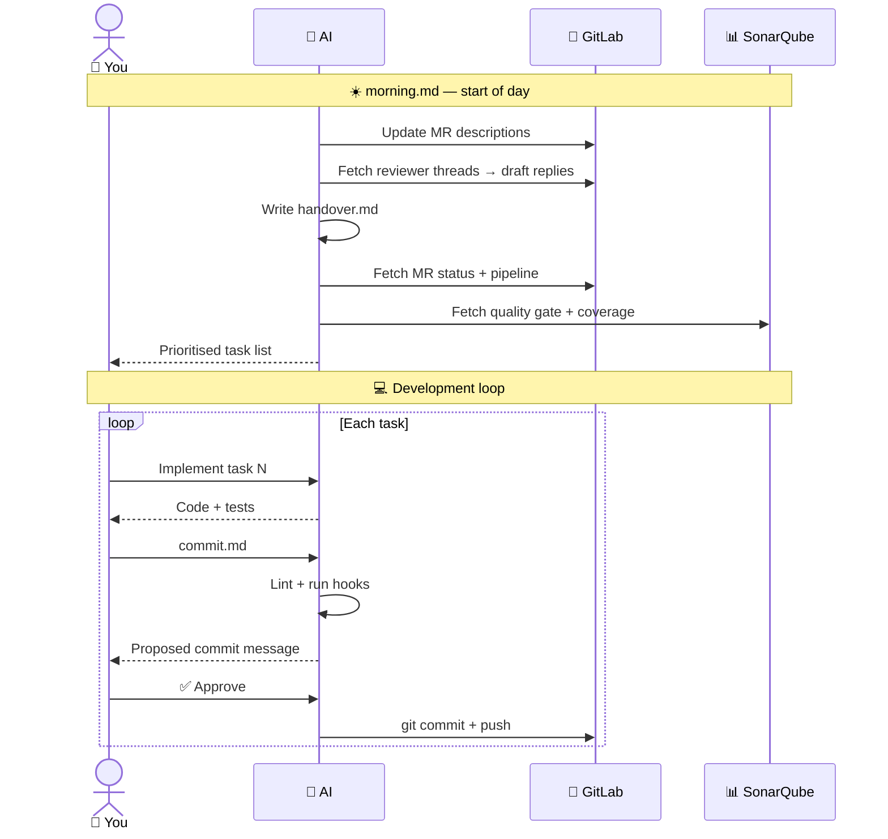

# AI-Assisted Workflows for Agile Developers

Stop managing branches, MRs, and status checks manually. These AI workflows handle the entire feature lifecycle — from user story to post-merge retrospective.

Works with **Claude Code** · **Cline** · **Kilo Code** · **Cursor** · **OpenCode** — any MCP-compatible AI assistant.

---

## Feature Lifecycle


```mermaid
flowchart TD
    A([👤 You have a story]) --> B

    subgraph S["🚀 start.md — once per feature"]
        B[Provide title + description + ACs] --> C[AI explores codebase]
        C --> D[AI generates execution plan]
        D --> E{You review plan}
        E -->|Changes needed| D
        E -->|✅ Approved| F[AI creates branch + GitLab MR]
    end

    F --> G

    subgraph LOOP["🔁 Development loop — repeat per task"]
        G[You + AI implement a task] --> H
        subgraph COMMIT["📝 commit.md"]
            H[AI shows diff + runs lint/tests] --> I{You approve commit?}
            I -->|✅ Yes| J[AI commits + pushes]
        end
    end

    J --> K

    subgraph MORNING["☀️ morning.md — every morning"]
        K[AI updates all MR descriptions] --> L[AI drafts thread replies]
        L --> M[AI writes handover]
        M --> N[AI checks GitLab + SonarQube]
        N --> O[📋 Prioritised task list for the day]
    end

    O -->|More work to do| G
    O -->|MR ready to merge| P

    subgraph CLOSE["✅ close.md — after merge"]
        P[You merge in GitLab] --> Q[AI compares delivery vs plan]
        Q --> R[📄 Retrospective written]
    end
```

---

## Workflows

| Workflow | When | You provide | AI does |
|---|---|---|---|
| **start.md** | New feature | Story title, description, ACs | Plan → branch → MR |
| **morning.md** | Every morning | Nothing | Wrap up yesterday + status check |
| **commit.md** | After code changes | Staged files | Lint → commit msg → push |
| **close.md** | After MR merged | Nothing | Retrospective |

### Daily Developer Flow


```mermaid
sequenceDiagram
    actor Dev as 👤 You
    participant AI as 🤖 AI
    participant GL as 🦊 GitLab
    participant SQ as 📊 SonarQube

    Note over Dev,SQ: ☀️ morning.md — start of day

    AI->>GL: Update MR descriptions
    AI->>GL: Fetch reviewer threads → draft replies
    AI->>AI: Write handover.md
    AI->>GL: Fetch MR status + pipeline
    AI->>SQ: Fetch quality gate + coverage
    AI-->>Dev: Prioritised task list

    Note over Dev,SQ: 💻 Development loop

    loop Each task
        Dev->>AI: Implement task N
        AI-->>Dev: Code + tests
        Dev->>AI: commit.md
        AI->>AI: Lint + run hooks
        AI-->>Dev: Proposed commit message
        Dev->>AI: ✅ Approve
        AI->>GL: git commit + push
    end
```

---

## Setup

### 1. Install MCP servers

```bash
pip install uv
uv pip install python-gitlab-mcp sonar-mcp
```

### 2. Install workflows

**Claude Code** (per project — workflows become `/start`, `/morning`, `/commit`, `/close` slash commands):
```bash
cp CLAUDE.md /path/to/your-project/
cp -r .claude /path/to/your-project/
```
Global rules (applies to all projects):
```bash
cat CLAUDE.md >> ~/.claude/CLAUDE.md
```

**Cline** (global — works for all projects):
```bash
mkdir -p ~/Documents/Cline/Rules ~/Documents/Cline/Workflows
cp .clinerules/rules.md ~/Documents/Cline/Rules/
cp .clinerules/workflows/* ~/Documents/Cline/Workflows/
```

**Kilo Code** (global):
```bash
mkdir -p ~/Documents/KiloCode/Rules ~/Documents/KiloCode/Workflows
cp .kilocoderules/rules.md ~/Documents/KiloCode/Rules/
cp .kilocoderules/workflows/* ~/Documents/KiloCode/Workflows/
```

**Cursor** (per project):
```bash
cp -r /path/to/cline-workflow/.cursor ./
```

**OpenCode** (per project):
```bash
cp -r /path/to/cline-workflow/.clinerules ./
```

### 3. Configure MCP servers

Add to your AI assistant's MCP settings (see table below for file locations):

```json
{
  "mcpServers": {
    "gitlab": {
      "command": "python-gitlab-mcp",
      "env": {
        "GITLAB_URL": "https://gitlab.company.tld",
        "GITLAB_TOKEN": "your-token",
        "GITLAB_ALLOWED_PROJECT_IDS": "12345"
      }
    },
    "sonarqube": {
      "command": "sonar-mcp",
      "env": {
        "SONAR_URL": "https://sonar.company.tld",
        "SONAR_TOKEN": "your-token"
      }
    }
  }
}
```

| Tool | MCP config location |
|---|---|
| Claude Code | `~/.claude/settings.json` → `mcpServers` key |
| Cline | VS Code → Cline → Settings → MCP Servers → Edit JSON |
| Kilo Code | VS Code → Kilo Code → Settings → MCP Servers → Edit JSON |
| Cursor | `.cursor/mcp.json` in project root |
| OpenCode | `~/.config/opencode/config.json` |

Get tokens: GitLab → Settings → Access Tokens (scope: `api`) · SonarQube → My Account → Security.

### 4. Configure your project

Create `memory-bank/current-mr.md` in your project root:

```yaml
base_branch: main
project_id: 12345
sonar_project_key: my-project
mr_template_path: .gitlab/merge_request_templates/default.md
precommit_runner: null   # lint-staged | pre-commit | both | null

merge_requests:
  - mr_iid: 67
    feature_branch: feature/user_auth_jwt
    description: "User authentication with JWT"
```

### 5. Try it

**Claude Code:**
```
/morning
```

**All other tools:**
```
Run the morning.md workflow
```

---

## Troubleshooting

**AI can't find workflows** — verify install paths:
```bash
ls .claude/commands/               # Claude Code
ls ~/Documents/Cline/Workflows/    # Cline
ls ~/Documents/KiloCode/Workflows/ # Kilo Code
```

**GitLab or SonarQube not connecting** — validate your setup:
```bash
python validate_mcp_setup.py
```

**Token errors** — ensure GitLab token has `api` scope and is not expired.

---

## MCP Servers

- [python-gitlab-mcp](https://github.com/wadew/gitlab-mcp) — reads/updates MRs, threads, pipelines
- [sonar-mcp](https://github.com/wadew/sonar-mcp) — quality gate, coverage, issues

---

MIT License
